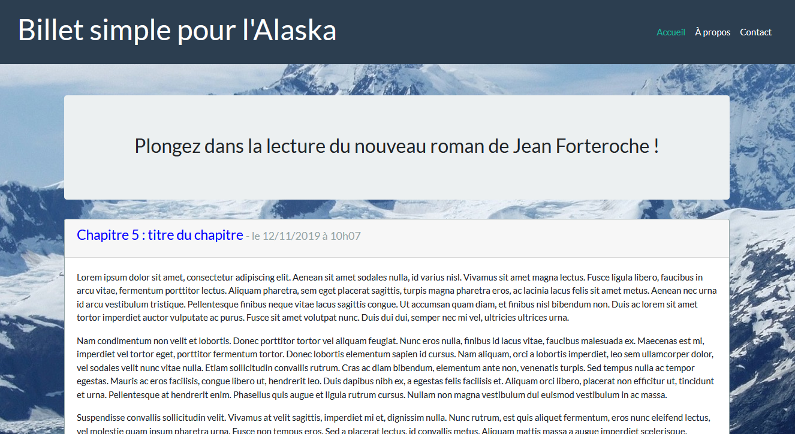
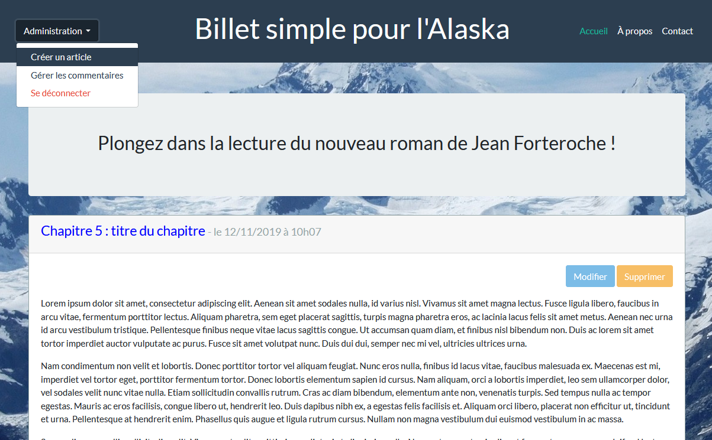

# Projet 4 - création d'un blog

## Introduction

Ce projet est un blog CRUD (Create, Read, Update, Delete) réalisé avec PHP et MySQL en utilisant l'architecture MVC (Modèle/Vue/Contrôleur).

Ce projet est visible en ligne à l'adresse : https://p4-blog.laurenceplatzer.com/

## Fonctionnalités

- création/lecture/modification/suppresion d'articles
- ajout de commentaires
- possibilité pour les visiteurs de signaler les commentaires indésirables
- interface d'administration avec gestion des commentaires et création/édition d'articles
- réécriture d'URL pour améliorer le SEO

